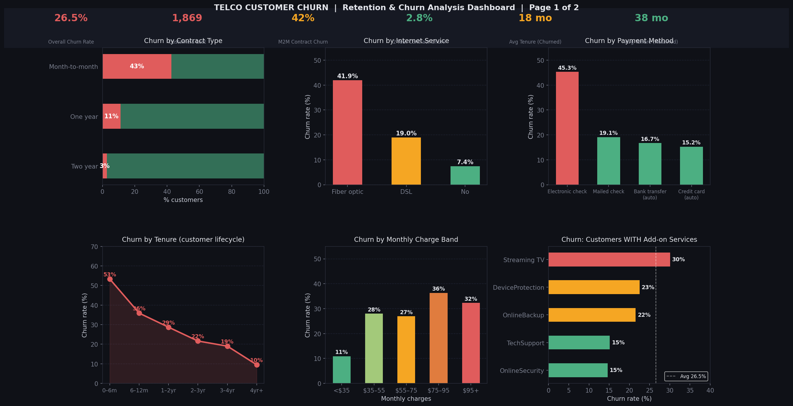
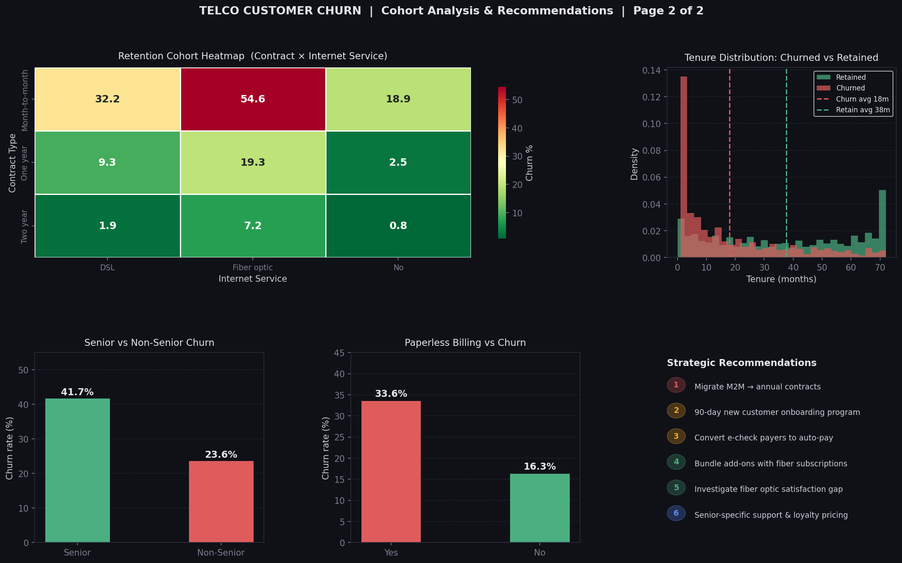
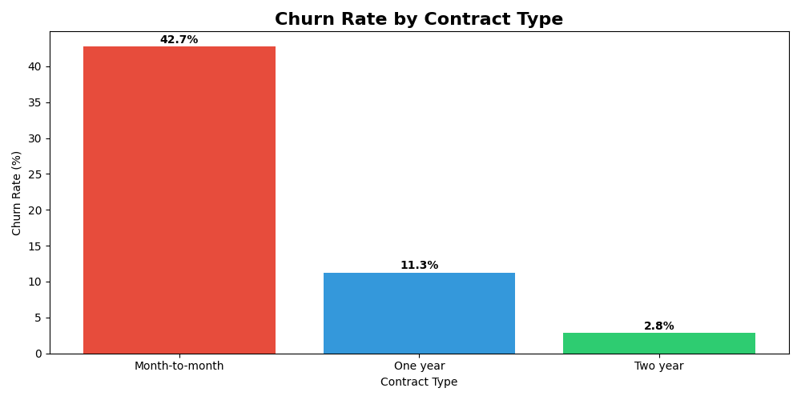
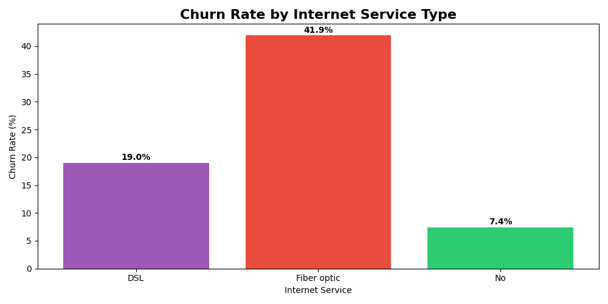
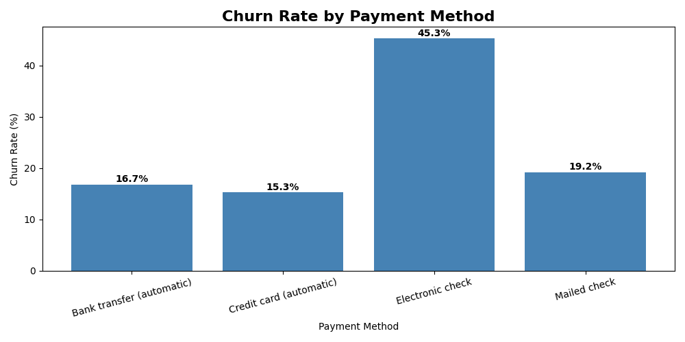
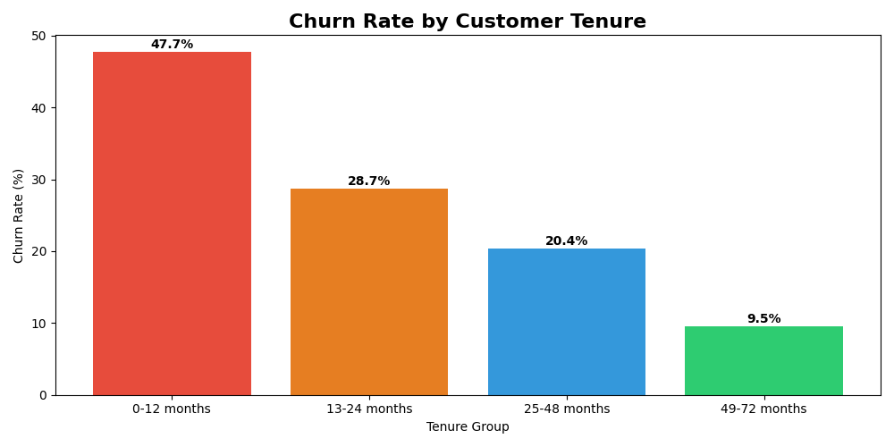

# Customer Retention & Churn Analysis
## Future Interns — Data Science Task 2

### Key Numbers
- Total Customers: 7,032
- Overall Churn Rate: 26.58%

### Key Insights
- Month-to-month customers churn at 42.7% vs only 2.8% on 2-year contracts
- Electronic Check users churn at 45.3% — 3x higher than auto-pay users
- New customers (0-12 months) churn at 47.7% — the first year is critical
- Fiber Optic customers churn at 41.9% — double the DSL rate

### Tools Used
- Python (Pandas, Matplotlib)
- VS Code
### Charts

